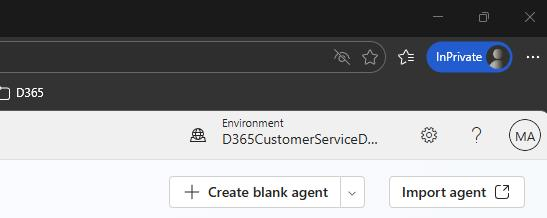
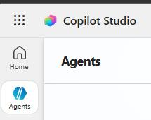
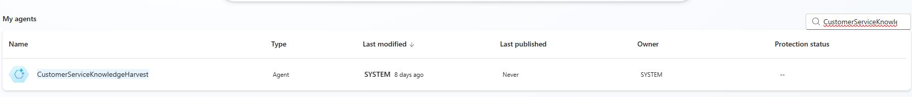
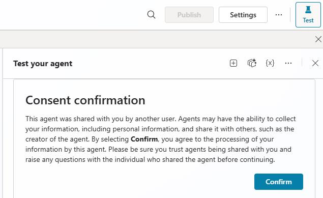

## Task 03: Publish the Microsoft Copilot Studio agent

### Introduction
Even with connections and flows enabled, Contoso won't see value unless the Knowledge Harvest agent is available to generate draft articles.

### Description
In this task, you'll open Copilot Studio, locate the **CustomerServiceKnowledgeHarvest** agent, and publish it so it can be used as part of the automated knowledge creation experience.

### Success criteria
- The CustomerServiceKnowledgeHarvest agent is published and available for use.

### Key steps

1. In Edge, go to `https://copilotstudio.microsoft.com/`.

1. If prompted, sign in using the administrative credentials for your demo environment.

1. At the top right of the page, select your demo environment.

	

1. In the left pane, select **Agents**.

	

1. Locate and select the **CustomerServiceKnowledgeHarvest** agent.

	{: .note }
    > The agents may not appear in alphabetical order. You can use the **Search agents** field to locate the agent.

	

1. If prompted for consent, select **Confirm**.

	

1. On the command bar, select **Publish**.

	{: .warning }
    > You may need to wait several minutes for the agent to complete some set-up steps before the **Publish** button becomes enabled.