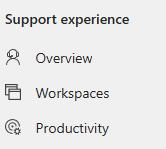
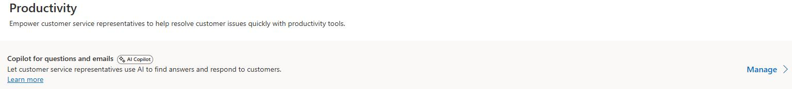
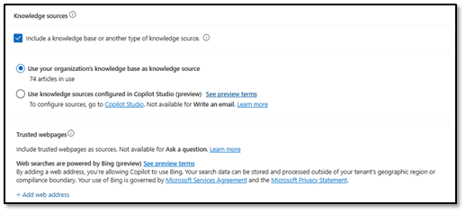

## Task 02: Configure Copilot

### Introduction
The Knowledge Management agent uses the copilot settings of your tenant to ensure that it creates knowledge articles as needed. To ensure that it can do this effectively, you're going to configure it to ensure that it is using your organizations internal Dynamics 365 knowledge management functionality.

### Description
In this task, you'll configure Copilot for Questions and email to include a knowledge source and explicitly use your organization's Dynamics 365 knowledge base as the knowledge source required for the Knowledge Management Agent to function.

### Success criteria
- Copilot is configured to use the organization's Dynamics 365 knowledge base as its active knowledge source..

### Key steps

1. Open **Copilot Service admin Center**.

	

1. In the left pane, in the **Support experience** section, select **Productivity**.

	

1. Locate **Copilot for Questions and email** and then select **Manage**.

	

1. Move down to the **Knowledge sources** section and select **Include a knowledge base or another type of knowledge source**. Then, select **Use your organizations knowledge base as knowledge source**. 

    {: .warning }
    > The knowledge management agent will only work if you're using the built in Dynamics 365 knowledge base.

    

1. On the command bar, select **Save and Close**.