## Task 03: Create a new knowledge article


### Introduction
As part of the Contoso Sample Data that has been deployed, you should have multiple knowledge articles that are deployed and published. If you do not have any articles, or you would like to create an article specific to certain use cases, customers, or scenario, following the information below.

### Description
In this task, you'll create a new knowledge article, move it through review and approval, optionally create a Spanish translation, and publish the article (and its translation) so it's available for Copilot and agents to reference.

### Success criteria
- A new knowledge article is created and published (with a published Spanish translation if completed).

### Key steps

1. In Edge, go to `https://make.powerapps.com/`. 

1. At the top right of the page, select your demo environment.

	

1. In the left pane, select **Apps**.
 	
     

1. On the command bar, select **All**.

	

1. Select the **Copilot Service workspace** app and then select **Play** to launch the app.

	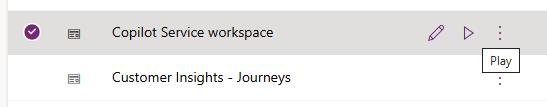

1. At the top left of the page, select **Site map** and then select **Knowledge Articles**.

    

1. In the command bar, select **+ New**.

	

1. Configure the knowledge article by using the following information:

    - **Title**: `Loud Noise`
    - **Keywords**: `Loud, Noise, Airpot, Troubleshoot`
    - **Description**: `Instructions for troubleshooting steps when there is a loud noise coming from a machine.`

	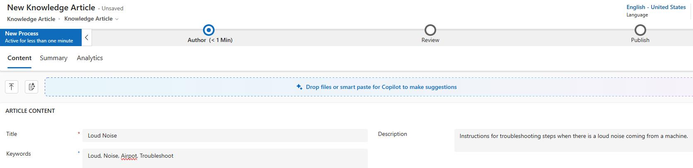

1. Paste the following text into the Content text editor:

    ```
    If there is a loud noise coming from your machine try the following:

    Reservoir Tank Machine

    - Verify that reservoir tank has water (should be at least half full)
    - Coffee grounds that are too course can cause a noise. Try grinding them finer.

    Direct Water Source Machine

    - Verify that the water to the machine is turned on.
    - Verify that there is not a kink in the hose.
    - Coffee grounds that are too course can cause a noise. Try grinding them finer.
    ```

1. Add bold font to **Reservoir Tank Machine** and **Direct Water Source Machine**.

    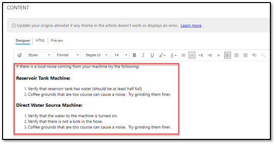

1. On the command bar, select **Save**. Leave the record open.

1. Go to the business process flow and select the **Author** stage.

	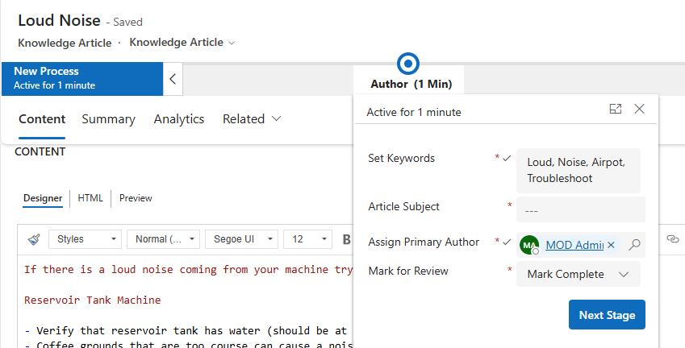

1. In the **Article Subject** field, select **Water supply**.

1. Set **Mark for Review** to **Completed**.

1. Select **Next Stage**.

    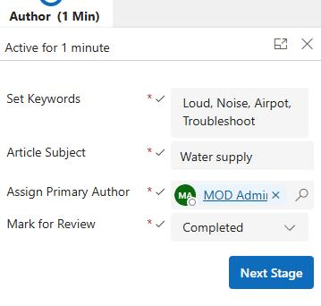

1. On the **Review** stage, in the **Review** field, select **Approved**.

1. Select **OK** to confirm approval.

	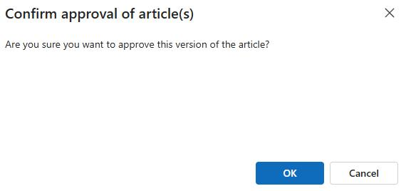

1. Close the **Review Stage**.

1. On the command bar, select the vertical ellipses (**...**). In the menu that appears, select **Translate**.

    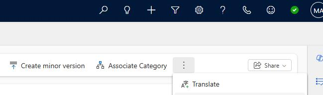

1. In the **Pick a language** field, select **Spanish - United States** and then select **Create**.

	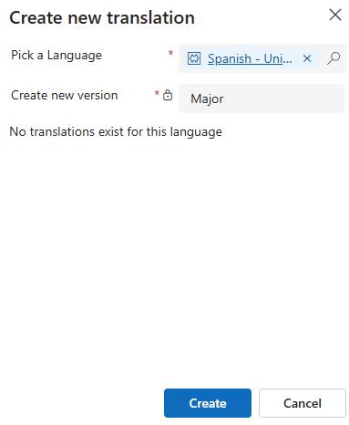

1. Select **OK** to open the **Article Translation**.

1. You should now have the Spanish version of the knowledge article open.

    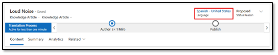

1. Replace the English content with Spanish content below.

    ```
    Si hay un ruido fuerte proveniente de su máquina, intente lo siguiente

    Máquina de tanque de depósito
    - Verifique que el tanque del depósito tenga agua (debe estar al menos medio lleno)
    - Los posos de café demasiado gruesos pueden causar ruido. Prueba a molerlos más finos.
    
    Máquina de fuente de agua directa
    - Verifique que el suministro de agua a la máquina esté abierto.
    - Verifique que no haya dobleces en la manguera.
    - Los posos de café demasiado gruesos pueden causar ruido. Prueba a molerlos más finos.
    ```

1. Add bold font to **Máquina de tanque de depósito** and **Máquina de fuente de agua directa**.

1. Select **Save**.

1. On the command bar, select **Approve**.

	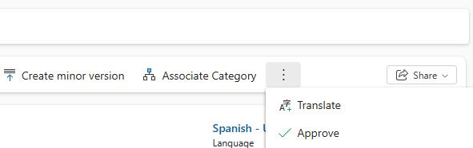

1. On the **Confirm approval of article** dialog, select **OK**.

1. On the command bar, select **Site Map** and then select **Knowledge Articles**.

1. Locate and then select the English version of the **Loud Noise** article.

	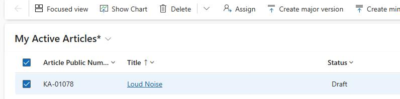

1. On the command bar, select **Publish**.

	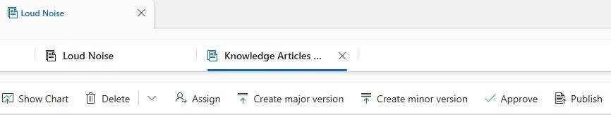

1. Configure the publication by using the following values and then select **Publish**:

    - **Publish**: Now
    - **Published status**: Published
    - **Expiration Date**: None
    - **Publish approved related translations with article**: Yes

	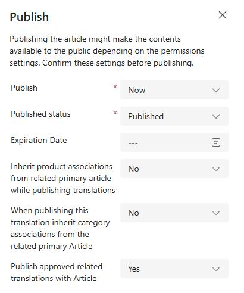
    
