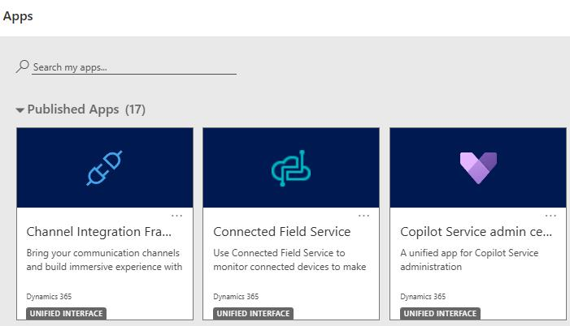
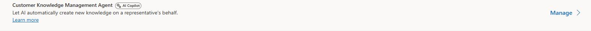
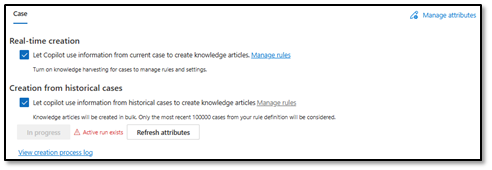
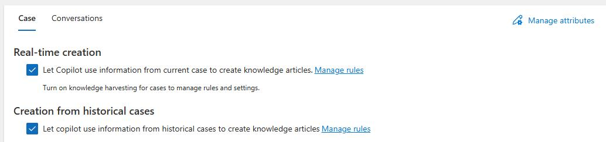
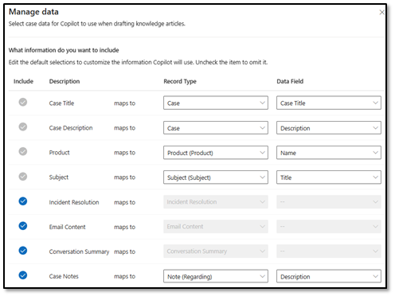

## Task 01: Configure the Knowledge Management agent

### Introduction
Before Contoso can automate article creation, the agent must be enabled for the right case scenarios and told which case attributes to use when drafting content.

### Description
In this task, you'll enable real-time and historical case-based creation for the Knowledge Management Agent, review the default case attributes it uses, and confirm the attribute set matches the intended configuration.

### Success criteria
- The Knowledge Management Agent is enabled for real-time and historical case creation with the correct case attributes selected.

### Key steps

1. Open **Copilot Service admin Center**.

	

1. In the left pane, in the **Support experience** section, select **Knowledge**.

1.  Locate **Customer Knowledge Management agent** and then select **Manage**.

    {: .highlight }
    > You may need to hit refresh for the record to display.
	
    

1. On the **Case** tile, select the following options:

    - **Let Copilot use information from current case to create knowledge articles.**
    - **Let copilot use information from historical cases to create knowledge articles.**

    

    {: .note }
    > By default, the Knowledge Management agent uses specific attributes from case records when drafting new articles. If you've made any modifications to existing fields or created a field that you want to be considered, you'll need to make any necessary changes.

1. On the **Case** tile, select **Manage Attributes**.

	

1. Ensure that the following rows are selected:

	- Incident Resolution
    - Email Content
    - Conversation Summary
    - Case Notes

    

1. Select **Save and Close**. Leave the **Customer Knowledge Management Agent** page open.