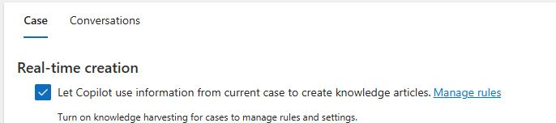
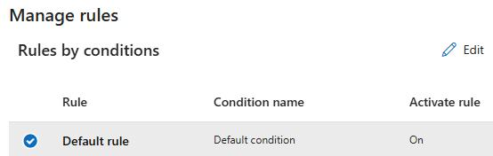
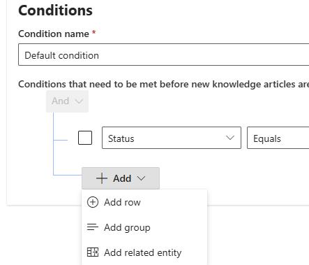
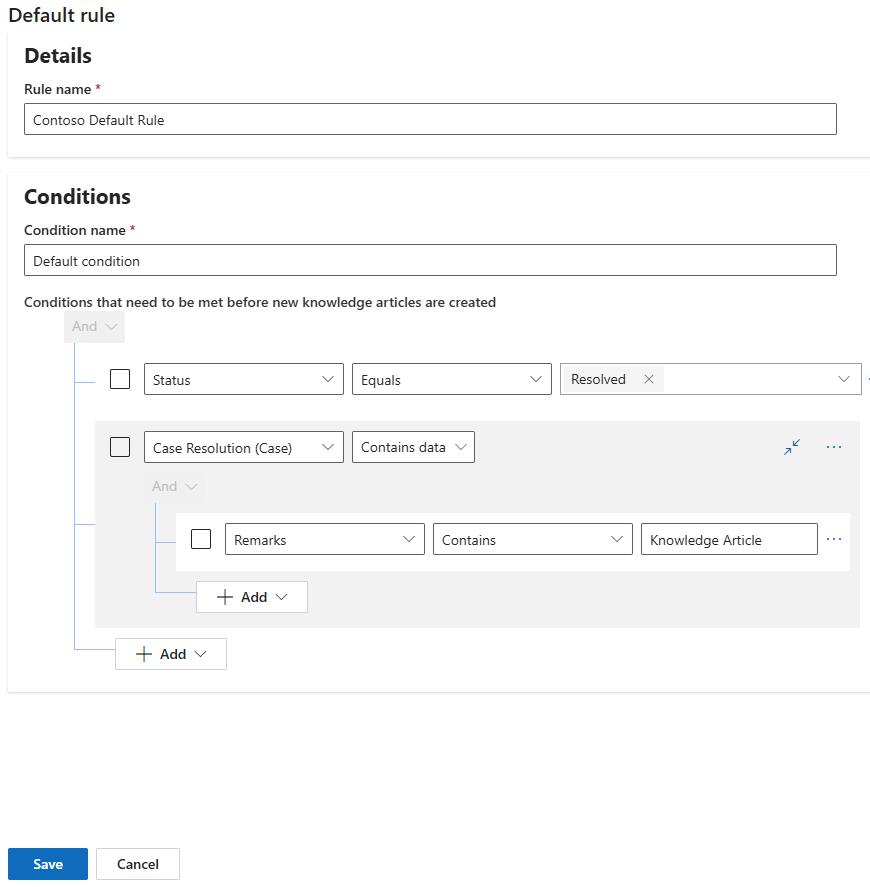
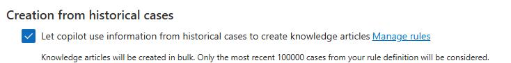
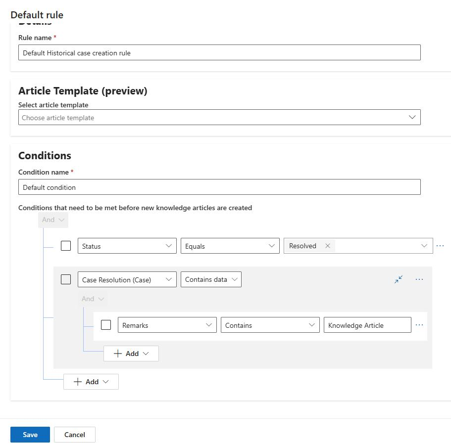
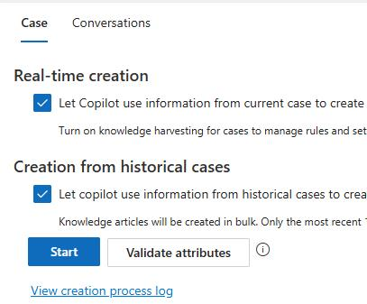

## Task 02: Define rules for automatic article creation

### Introduction
Contoso doesn't want a new knowledge article for every resolved case-only for cases where the resolution includes meaningful, reusable guidance.

### Description
In this task, you'll create and edit rules that control when the agent generates articles for real-time and historical cases, using conditions such as case status and case resolution remarks to filter when drafting should occur.

### Success criteria
- Rules are saved for real-time and historical creation so articles are generated only when cases meet the defined conditions.

1. On the **Customer Knowledge Management Agent** page, in the **Real-time creation** section, select **Manage Rules**.

	

1. Select the **Default** rule and then select **Edit**.

    

1. Change the name to `Contoso Default Rule`.

1. In the **Conditions** section, select **Add**. Configure the rule as follows:

    **Status > Equals > Resolved**.

	

1. Select **Add** again and then select **Add related entity**. 

1. Configure the condition as follows:

    - **Case Resolution (Case) > Contains Data**.
    - **Remarks > Contains > Knowledge Article**.

    

1. Select **Save**.

1. Close the **Manage Rules** pane.

1. 1. On the **Customer Knowledge Management Agent** page, in the **Create from historical cases** section, select  **Manage Rules**.

	

1. Name the rule `Default Historical case creation rule`.

1. In the **Conditions** section, select **Add**. Configure the rule as follows:

    - **Status > Equals > Resolved**.

1. Select **Add** again and then select **Add related entity**. 

1. Configure the condition as follows:

    - **Case Resolution (Case) > Contains Data**.
    - **Remarks > Contains > Knowledge Article**.

1. Select **Save**.

	

1. On the **Case** tile, select **Start**.

	

1. In the confirmation dialog, select **Start**.

1. Leave the **Customer Knowledge Management Agent** page open.