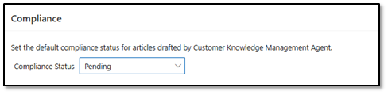
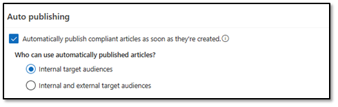

## Task 03: Define publishing rules

### Introduction
Automatically generated drafts can improve speed and consistency, but Contoso still needs governance to ensure only appropriate content gets published and shared.

### Description
In this task, you'll configure compliance and auto-publishing settings, choose who can use automatically published articles, and save the final governance configuration for the agent.

### Success criteria
- Publishing and compliance settings are configured so auto-created articles follow the intended approval and audience controls.

{: .note }
> Automatically created articles may not be ready to be published. This is particularly true in the initial phases of automatically creating articles. It is a good idea to have someone review articles to ensure that the content is accurate.

### Key steps

1. On the **Customer Knowledge Management Agent** page, locate the **Compliance** section and set the value for the **Compliance Status** field to **Pending**.

    

1. In the **Auto publishing** section, select **Automatically publish compliant articles as soon as they are created** and then select **Internal Target Audiences**.

    

1. Select **Save and Close**.