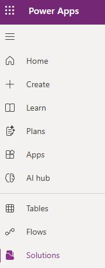
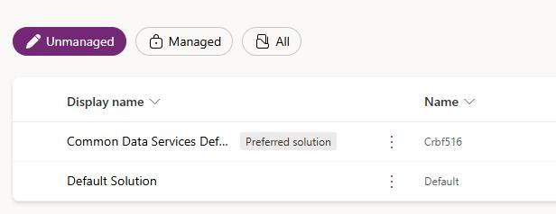
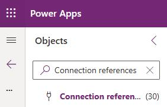
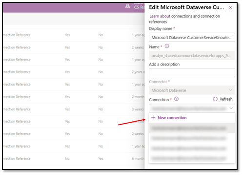
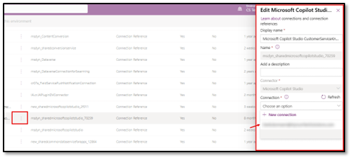
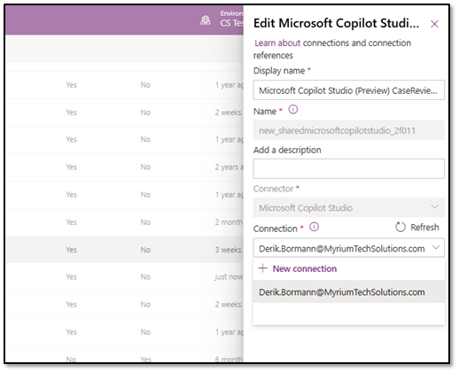

# Task 01: Set connection references for Customer Knowledge Management agent flow

## Introduction

If the solution can't authenticate to Dataverse and Copilot Studio, the knowledge harvest process won't be able to retrieve case details or generate draft content consistently.

## Description

In this task, you'll open the Default Solution and set the required connection references so the knowledge harvest components can access Dataverse and Copilot Studio using the correct environment credentials.

## Success criteria

- All required connection references are configured and saved with valid connections.

## Steps

1. In Edge, go to `make.powerapps.com`.

1. At the top of the page, select your demo environment.

1. In the left pane, select **Solutions**.

    

1. Select **Default Solution**.

    

1. In the **Objects** pane, search for and select **Connection references**.

    

1. Search for the following the **Microsoft Dataverse** connection reference: **CustomerServiceKnowledgeHarvest**

    {: .highlight }
    > **Hint:** If you're not seeing it initially, you can enter it in the search criteria.

1. Hover over the reference and select **Edit**.

1. In the **Edit** dialog, select **Connection**, then **New connection**.

    {: .note }
    > If you already have a connection, you can use that one.

    

1. Search for **Microsoft Dataverse**, select the plus sign (**+**), then select **Create**.

    {: .highlight }
    > **Hint:** If you have multiple connections, just choose one of them. As long as they are both using your SE tenant credentials.

1. Select your **SE Account**.

1. Go back to **Solutions** and open the **Default Solution** again.

1. Under **Objects**, search for and select **Connection References**.

1. Search for the following **Microsoft Dataverse** connection reference: **CustomerServiceKnowledgeHarvest**.

1. Hover over the reference and select **Edit**.

1. Select the connection you just created and then **Save**.

**Next, repeat this process for the other connectors.**

1. Search for the following the **Microsoft Copilot Studio CustomerServiceKnowledgeHarvest** connection reference.

1. Hover over the reference and select **Edit**.

    

1. Select your SE account connection and select **Save**.

1. Search for the following the **Microsoft Copilot Studio (Preview)** connection reference.

1. Hover over the reference and select **Edit**.

    

1. Select the connection you just created and select **Save**.
