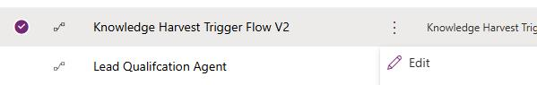
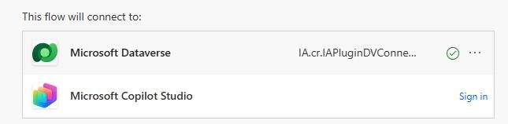
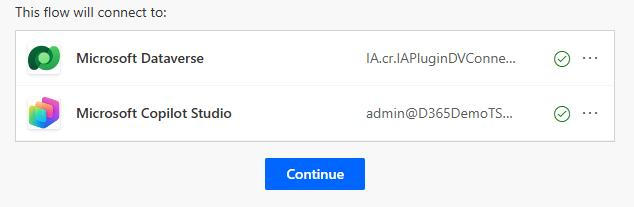
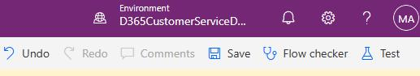
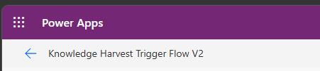
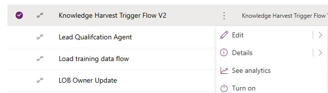

# Task 02: Turn on the Power Automate flow

## Introduction

Contoso's knowledge creation needs to happen automatically, not as a manual step that busy agents forget during peak demand.

## Description

In this task, you'll locate the Knowledge harvest Trigger Flow V2 in Power Automate and turn it on so case events can trigger the knowledge harvesting process.

## Success criteria

- Knowledge harvest Trigger Flow V2 is turned on in the correct environment.

## Steps

1. In Edge, go to `https://make.powerapps.com`.

1. If prompted, sign in by using the administrative credentials for your demo environment.

1. At the top right of the page, select your demo environment.

    

1. In the left pane, select **Solutions**.

    

1. Select **Default solution**.

    

1. In the **Objects** pane, search for and select **Cloud flows**.

    

1. Locate the **Knowledge harvest Trigger Flow V2**.

    

1. Select the ellipses (**...**) next to the flow and then select **Edit**.

    

1. For any disconnected resources, select **Sign in**.

    

1. Select **Continue**.

    

1. On the command bar, select **Save**.

    

1. At the top left of the page, select the Back arrow.

    

1. Select the ellipses (**...**) next to the flow and then select **Turn on**.

    
