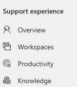
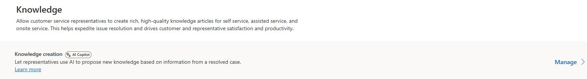
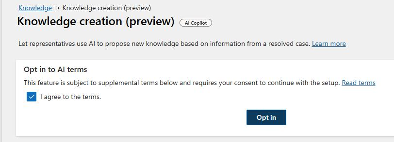
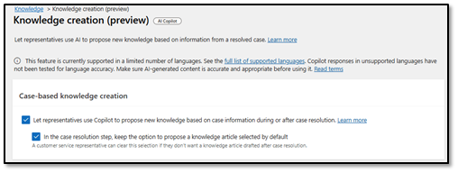

# Task 01: General configuration

## Introduction

Before you can configure and leverage the Knowledge Management Agent, you'll need to ensure that your baseline knowledge management functionality is configured. This will include ensuring that specific features are enabled and turning on anything that is necessary for support.

## Description

In this task, you'll enable case-based knowledge creation settings so representatives can propose new knowledge from case details and keep the propose-article option selected by default during case resolution.

## Success criteria

- Case-based knowledge creation is enabled with Copilot proposals turned on and defaulted during case resolution.

## Steps

1. Open **Copilot Service admin Center**.

    

1. In the left pane, in the **Support experience** section, select **Knowledge**.

    

1. Locate **Knowledge Creation** and then select **Manage**.

    

1. Select **I agree to the terms.** and then select **Opt in**.

    

1. In the **Case-based knowledge creation** section, enable the following options:

    - **Let representatives use Copilot to propose new knowledge based on case information during or after resolution.**
    - **In the case resolution step, keep the option to propose a knowledge article selected by default.**

    

1. On the command bar, select **Save and Close**.
