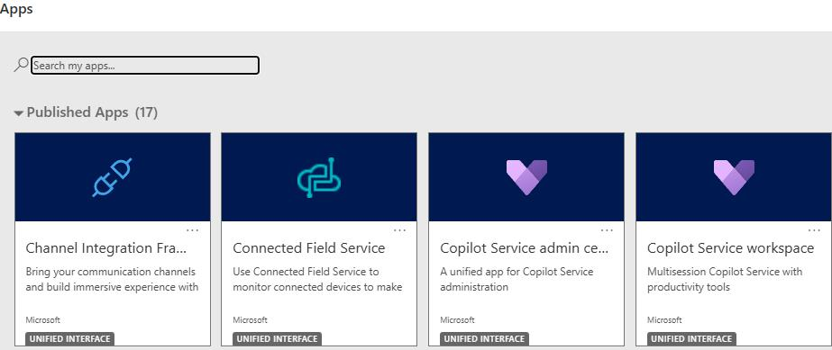

# Task 02: Demonstrate the agent experience

## Steps

1. Open the **Customer Service workspace** app.

    

1. Sign in as **Alan Steiner**.

1. From the **Home** screen, wait for an incoming conversation.

    {: .note }
    > The conversation can be from any channel that you configured for this demo, such as chat, voice, or WhatsApp.

1. Select **Accept**. The conversation opens in a new session tab. Once the conversation is open, here are some helpful elements that you can call out as part of the initial tour:

    - **Session Tabs**: Each interaction opens in its own tab.

    - **Customer Summary panel**:
        - Contact details
        - Recent cases
        - Entitlements

    - **Conversation panel**:
        - Call out the transcript and how the complete conversation history displays.
        - Agent input box
        - Real-time sentiment analysis
        - Quick replies

    - **Copilot Panel** (right side):
        - **Copilot** suggestions
        - **Ask Copilot questions**
        - **Case Management Agent** insights

    After your tour, continue your talk track from the agent's perspective.

1. As the conversation progresses, the **Case Management Agent** automatically:

    - Suggests creating a new case.
    - Uses AI to pre-fill in data such as the case title, subject, and description.
    - Automatically links the case to the customer record.

1. Select **Create Case** when prompted. The case form opens in a new tab with pre-populated fields.

1. Update the case form as needed. For example, you can change the case priority or assign the case to a queue.
