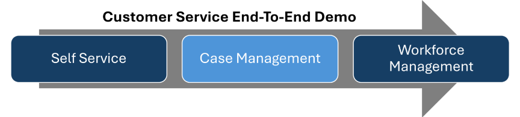

# TechWorkshop L400 on-demand: Knowledge Management Agent

## Where does this fit in as part of an end-to-end demo?

## Use case / scenario

Contoso Coffee stands as one of the leading producers of premium coffee machines in the United States, boasting an extensive clientele that surpasses 5 million with $1 Billion revenue. This customer base is provided with a variety of sophisticated coffee machines, in addition to options for ordering coffee supplies, service agreements, and extended warranties. Contoso caters to both business-to-business (coffee shops) and business-to-consumer (individual buyers) markets.

One of the areas of concern that came up during your conversations with the customer is whether there is a knowledge management system. As you dive deeper into conversations with the customer you uncover several pain points:

- Current knowledge landscape is content sitting in different sources with no consistent formatting.
- As more senior representatives move on, they are losing a lot of that knowledge.
- The current process for creating knowledge articles is complex and not user friendly, therefore it is not being done.
- Customers are getting different responses based on who is handling the case (No consistency).

### Business challenges you're trying to solve

- Enable agents to quickly access relevant knowledge and customer history.
- Improve the quality of the knowledge content that is being created.
- Simplify the process for creating content to reduce the burden on representatives.
- Ensure that knowledge management solutions are integrated into their current infrastructure.

## Learning objectives

Upon successful completion of this lab, you'll:

- Set up knowledge management and AI-powered search.
- Deploy the Knowledge Management Agent to ensure that articles are being created in a timely fashion and are correct.
- Demonstrate how Dynamics 365 improves knowledge management and information transfer.

## What you'll configure

- Configure tables, forms, and other supporting elements as required.
- Configure necessary supporting technologies as required to support the functionality.
- Enable and configure the Knowledge Management agent.

## Time to complete

Estimated time: 30 to 45 minutes

## Prerequisites

{: .warning }
> You must complete the required steps in the **TechWorkshop L300 on-demand: Sales & Service MDX Setup** lab before you start this lab. This ensures that your environment is configured properly and includes all resources that are required to support this lab.
